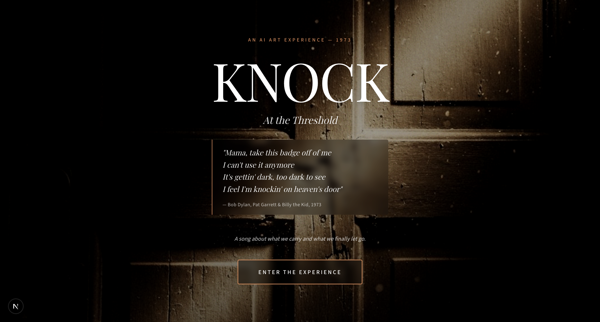

KNOCK — Design Your Door

CSE 358 Introduction to Artificial Intelligence

An interactive AI artwork that transforms a user’s personal reflection into a symbolic image and a short poem, inspired by Bob Dylan’s “Knockin’ on Heaven’s Door” (1973).

🧠 Concept

This project explores thresholds — moments where something is left behind.

The user writes a short reflection (something they want to let go of), and the system generates:

a 4-line poem
a cinematic image

Both outputs are built around a single idea:

what remains after the moment of leaving

The system avoids direct explanation and instead expresses meaning through:

objects
space
absence
⚙️ AI Techniques Used

This project combines two distinct AI techniques:

1. Language Model (LLM)
Generates the poem
Interprets the user’s reflection into a symbolic scene
2. Text-to-Image Generation
Converts the symbolic scene into a cinematic image

These techniques are connected through a custom pipeline, not used independently.

🔁 Pipeline Overview
User Input (reflection)
        ↓
Symbolic Interpretation (LLM → structured scene)
        ↓
Poem Generation (LLM, streaming)
        ↓
Image Prompt Construction
        ↓
Image Generation (diffusion model)

Key idea:
👉 The system constructs meaning first, then generates visuals

🧩 Technical Architecture
Frontend
Next.js (App Router)
React
Tailwind CSS
Backend
API routes (/api/generate-poetry, /api/generate-image)
OpenAI API integration
Core Logic
Prompt design for symbolic interpretation
Streaming text generation
Structured transformation from text → image
🛠️ Installation
1. Clone the repository
git clone https://github.com/nilufersevde/knock-project.git
cd knock-project
2. Install dependencies
pnpm install

(or npm install)

3. Set environment variable

Create .env.local in the root:

OPENAI_API_KEY=your_api_key_here
4. Run the project
pnpm dev

Open:

http://localhost:3000

🎨 Design Choices
No explicit war imagery
No visible human figures in images
One central symbolic object per scene
Minimal composition (no clutter)

The project focuses on:

what is left behind
not who leaves

🕰️ Historical Context

The project is inspired by:

Knockin’ on Heaven’s Door (1973)
the film Pat Garrett & Billy the Kid
themes of:
farewell
release
identity loss
transition

Rather than direct references, the historical context is embedded through:

visual tone
materials
atmosphere

🧠 AI as a System

In this project, AI acts as:

Interpreter → transforms text into symbolic meaning
Generator → produces poem and image
Collaborator → participates in shaping the final output

The structure, constraints, and pipeline are manually designed.

📁 Project Structure
app/
  api/
    generate-poetry/
    generate-image/

components/
lib/
  poetry-prompt.ts
  image-prompt.ts

📸 Example Output

👤 Author

Nilüfer Sevde Özdemir
MD + MSc Computer Science Engineering

🧩 Final Note

This project is not about generating content.

It is about translating a moment of transition into a symbolic scene, 
the moment just before crossing a door.
